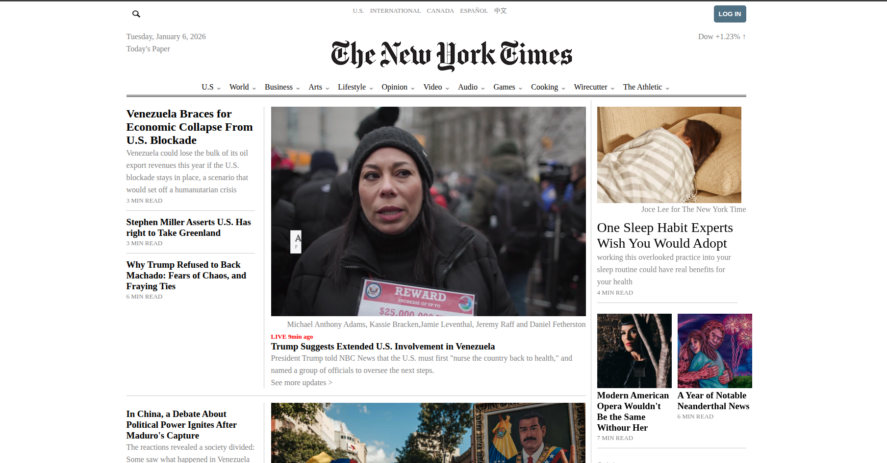
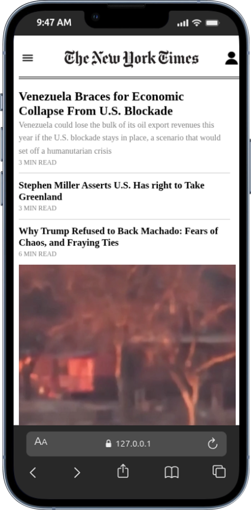

# New York Time Replica
This is a New York Time replica site created using **HTML** and **CSS** given by our teachers at **Rebase Code Camp**. We learned a lot while building the project because we met things we haven't done before but because of research using w3school other platforms we succeeded to do it on stuff like video display content and so many. Working with a collaborator was so good and impressive.

---

## Preview and How to use
(open `index.html` or the deployed link to view New York Time replica)
- Deployed link: [https://komoforbrandon.github.io/dev/]

## Folder Structure
```text
.New-York-Time-replica
|___asssets__images
|          |__videos
|
|___styles/style.css
|____index.html

```
## Example Output of the Whitepace site
This is Desktop view


---

This is Mobile view



---

## Built with
- HTML
- CSS
- with IDE VS Code

---

## Features
- Clean and simple layout
- A clean design
- Car name with the car image
- Each car with the rent price
- Responsive design
- A good header

---

## Authors
- Names: **Komofor Brandon** and **Manga Dorian**
- Github: [https://github.com/komoforbrandon] and [https://github.com/Dorian4563]

---

## Acknowledgements
- Inpiration from **Rebase Code Camp** and my teachers **Madam Faith and Vanessa**